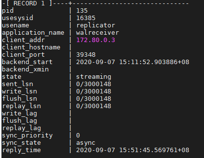
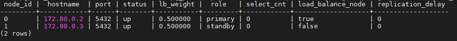

# pg_cluster
1. 安装docker、docker-compose环境  
2. 开启容器

       docker-compose up -d --build

2. 检查主从是否配置好：

       docker exec -it postgres /bin/sh -c "psql -U postgres -x -c \"select * from pg_stat_replication\""
       
     
3. 检查pgpool状态：

       docker exec -it pgpool bash
       export PGPASSWORD=pg_pwd && psql -h localhost -p 5432 -U postgres postgres -c "show pool_nodes"
       
      